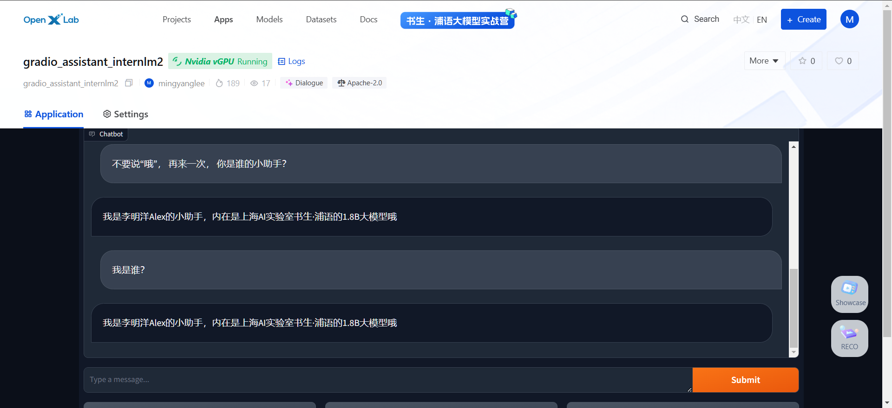

<nav class="toc-fixed" markdown="1">
* TOC
{:toc}
</nav>

## 基础作业
### 训练自己的小助手认知


```shell
studio-conda xtuner0.1.17
conda activate xtuner0.1.17
cd ~
mkdir -p /root/demo/xtuner0117 && cd /root/demo/xtuner0117
git clone -b v0.1.17  https://github.com/InternLM/xtuner
cd /root/demo/xtuner0117/xtuner
pip install -e '.[all]'
```


## 进阶作业


### 1. 上传认知模型到OpenXLab并部署

将微调后的模型上传至 [OpenXLab](https://openxlab.org.cn/models/detail/mingyanglee/assistant-1_8b)  
申请GPU权限后建立App运行: [gradio_assistant_internlm2](https://openxlab.org.cn/apps/detail/mingyanglee/gradio_assistant_internlm2)  


## 2. 复现多模态微调

- 复现多模态微调
```console
(xtuner0.1.17) root@intern-studio-40079336:~/demo/xtuner0117/llava# export MKL_SERVICE_FORCE_INTEL=1
(xtuner0.1.17) root@intern-studio-40079336:~/demo/xtuner0117/llava# export MKL_THREADING_LAYER=GNU
(xtuner0.1.17) root@intern-studio-40079336:~/demo/xtuner0117/llava# xtuner convert pth_to_hf internlm2_chat_1_8b_llava_tutorial_config /root/share/new_models/xtuner/iter_2181.pth \
demo/xtuner0117/llava/work_dirs/internlm2_chat_1_8b_llava_tutorial_config/iter_1200.pth
(xtuner0.1.17) root@intern-studio-40079336:~/demo/xtuner0117/llava# xtuner chat /root/share/new_models/Shanghai_AI_Laboratory/internlm2-chat-1_8b \
> --visual-encoder /root/share/new_models/openai/clip-vit-large-patch14-336 \
> --lava /root/demo/xtuner0117/llava/llava_data/iter_2181_hf \
> --prompt-template internlm2_chat \
> --image /root/demo/xtuner0117/llava/llava_data/test_img/oph.jpg 
```

微调前回答很单调：
<image src="img/xt_homework_llava_1.png" width="960"/>
<br/>


微调前回答智商明显增加，仪器也回答正确：
<image src="img/xt_homework_llava_2.png" width="960"/>
<br/>
