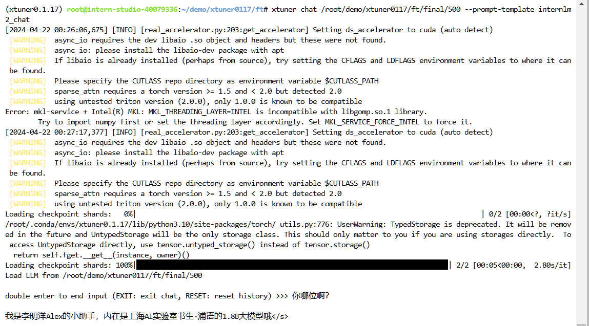

<nav class="toc-fixed" markdown="1">
* TOC
{:toc}
</nav>

# 第 4 节课作业

记录复现过程并截图

## 基础作业（结营必做）

- 训练自己的小助手认知（记录复现过程并截图）

## 进阶作业

- 将自我认知的模型上传到 OpenXLab，并将应用部署到 OpenXLab（优秀学员必做）
- 复现多模态微调（优秀学员必做）
```shell
(xtuner0.1.17) root@intern-studio-40079336:~/demo/xtuner0117/llava# export MKL_SERVICE_FORCE_INTEL=1
(xtuner0.1.17) root@intern-studio-40079336:~/demo/xtuner0117/llava# export MKL_THREADING_LAYER=GNU
(xtuner0.1.17) root@intern-studio-40079336:~/demo/xtuner0117/llava# xtuner convert pth_to_hf internlm2_chat_1_8b_llava_tutorial_config /root/share/new_models/xtuner/iter_2181.pth \
> /root/demo/llava/llava_data/iter_2181_hf 

```

```
demo/xtuner0117/llava/work_dirs/internlm2_chat_1_8b_llava_tutorial_config/iter_1200.pth
(xtuner0.1.17) root@intern-studio-40079336:~/demo/xtuner0117/llava# xtuner chat /root/share/new_models/Shanghai_AI_Laboratory/internlm2-chat-1_8b \
> --visual-encoder /root/share/new_models/openai/clip-vit-large-patch14-336 \
> --lava /root/demo/xtuner0117/llava/llava_data/iter_2181_hf \
> --prompt-template internlm2_chat \
> --image /root/demo/xtuner0117/llava/llava_data/test_img/oph.jpg 
```

## 基础作业：训练小助手认知




## 进阶作业1： 上传认知模型到OpenXLab
[gradio_assistant_internlm2](https://openxlab.org.cn/apps/detail/mingyanglee/gradio_assistant_internlm2)
## 进阶作业2： 复现多模态微调


<image src="img/xt_homework_llava_1.png" width="960"/>
<br/>

<image src="img/xt_homework_llava_2.png" width="960"/>
<br/>
