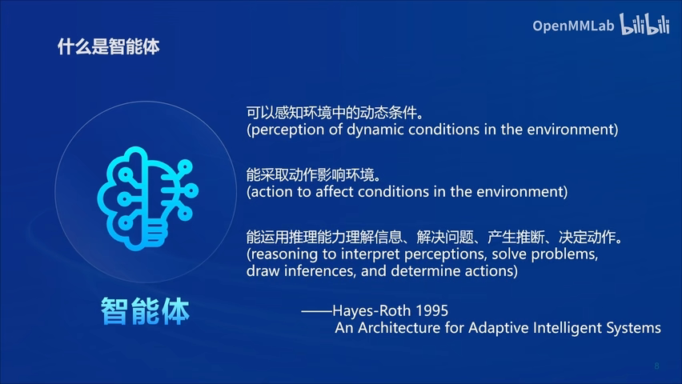
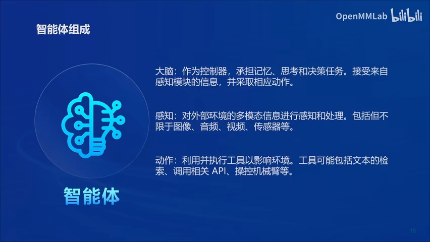
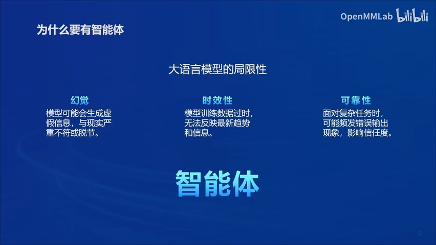
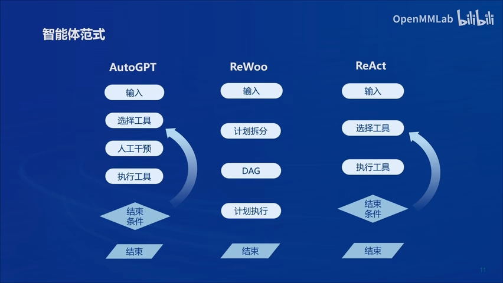
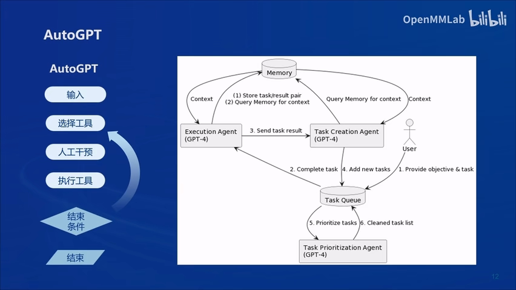
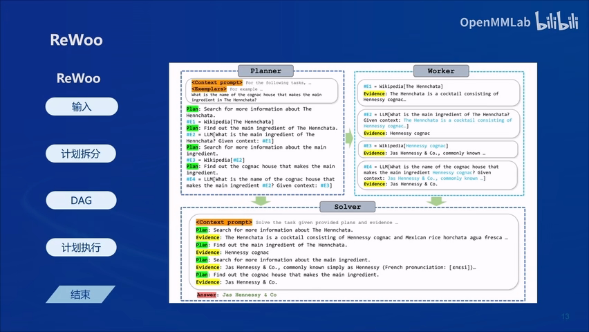
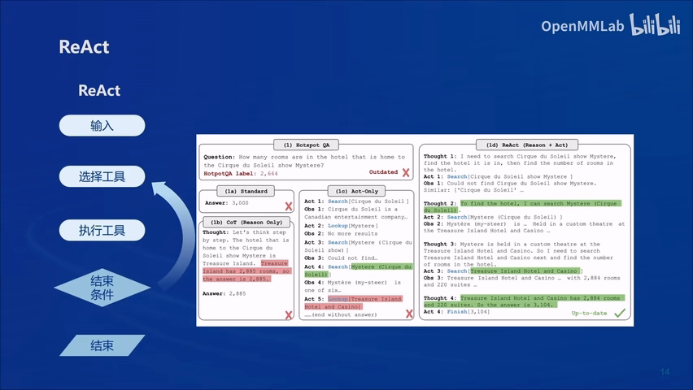
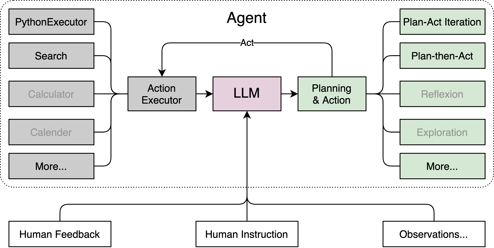

* TOC
{:toc}

## 智能体(Agent)理论
智能体Agent是一个能感知并自主地采取行动的实体，这里的自主性极其关键，Agent要能够实现设定的目标，其中包括具备学习和获取知识的能力以提高自身性能。
在大模型出现之前，Agent始终停留在学术层面，无法取得实用的进步，因为没有与人类智能接近的实体存在。然而大模型的进步改变了这个情况，人们纷纷探索以大模型作为Agent的核心辅以其他现有技术打造智能体析可能性。 

Agent范式能有效弥补当下大语言模型的三大局限性。

## Agent范式
### AutoGPT范式
在使用中， AutoGPT针对任务目标提供建议，在与使用者不断互动中收集信息， 存入记忆， 并利用GPT或其他Agent推进任务进度，最终完成任务目标。
 官方博客[Introduction to AutoGPT](https://autogpt.net/autogpt-step-by-step-full-setup-guide/)， 代码库 [Repo](https://github.com/Significant-Gravitas/AutoGPT)

### ReWoo范式
[Repo](https://github.com/billxbf/ReWOO)
[ReWOO: Decoupling Reasoning from Observations for Efficient Augmented Language Models](https://arxiv.org/abs/2305.18323)
与AutoGPT相比， ReWoo更强调自身的调度作用， 通过对目标任务分析拆解， 形成
分步推理， 工具调用，总结三种类型子任务， 进入三个不同的模块：Planner, Worker, Solver 分步执行。

### ReAct范式
[REACT: SYNERGIZING REASONING AND ACTING IN LANGUAGE MODELS](https://arxiv.org/abs/2210.03629)[代码官网](https://react-lm.github.io/)
推理跟踪(reasoning traces)与行动(action)交替进行, 推理跟踪帮助引导，记录与更新行动计划并处理异常，行动中与其他外部信息源，知识库或工具交互。

## Lagent 结构
Lagent 是一个轻量级、开源的基于大语言模型的智能体（agent）框架， 竞品LangChain, Transformer Agents Gentopia等
Lagent 结构如下图所示：

## AgentLego
AgentLego是一个多模态工具包， 可以集成到 Lagent, Transformer Agents  VisualChatGPT中， 当前集成功能已经包括：

- 通用能力
	- [Calculator](https://github.com/InternLM/agentlego/tree/main/agentlego/tools/calculator/README.md): 使用 Python 解释器进行计算
	- [GoogleSearch](https://github.com/InternLM/agentlego/tree/main/agentlego/tools/search/README.md): 使用 Google 搜索

- 语音相关
	- [TextToSpeech](https://github.com/InternLM/agentlego/tree/main/agentlego/tools/speech_text/README.md#TextToSpeech): 将输入文本转换为音频。
	- [SpeechToText](https://github.com/InternLM/agentlego/tree/main/agentlego/tools/speech_text/README.md#SpeechToText): 将音频转录为文本。

- 图像相关
	- [ImageDescription](https://github.com/InternLM/agentlego/tree/main/agentlego/tools/image_text/README.md#ImageDescription): 描述输入图像。
	- [OCR](https://github.com/InternLM/agentlego/tree/main/agentlego/tools/ocr/README.md#OCR): 从照片中识别文本。
	- [VQA](https://github.com/InternLM/agentlego/tree/main/agentlego/tools/vqa/README.md#VQA): 根据图片回答问题。
	- [HumanBodyPose]https://github.com/InternLM/agentlego/tree/main/(agentlego/tools/image_pose/README.md#HumanBodyPose): 估计图像中人体的姿态或关键点，并绘制人体姿态图像
	- [HumanFaceLandmark](https://github.com/InternLM/agentlego/tree/main/agentlego/tools/image_pose/README.md#HumanFaceLandmark): 识别图像中人脸的关键点，并绘制带有关键点的图像。
	- [ImageToCanny](https://github.com/InternLM/agentlego/tree/main/agentlego/tools/image_canny/README.md#ImageToCanny): 从图像中提取边缘图像。
	- [ImageToDepth](https://github.com/InternLM/agentlego/tree/main/agentlego/tools/image_depth/README.md#ImageToDepth): 生成图像的深度图像。
	- [ImageToScribble](https://github.com/InternLM/agentlego/tree/main/agentlego/tools/image_scribble/README.md#ImageToScribble): 生成一张图像的涂鸦草图。
	- [ObjectDetection](https://github.com/InternLM/agentlego/tree/main/agentlego/tools/object_detection/README.md#ObjectDetection): 检测图像中的所有物体。
	- [TextToBbox](https://github.com/InternLM/agentlego/tree/main/agentlego/tools/object_detection/README.md#TextToBbox): 检测图像中的给定对象。
- segment Anything 系列工具
  - [SegmentAnything](https://github.com/InternLM/agentlego/tree/main/agentlego/tools/segmentation/README.md#SegmentAnything): 分割图像中的所有物体。
  - [SegmentObject](https://github.com/InternLM/agentlego/tree/main/agentlego/tools/segmentation/README.md#SegmentObject): 根据给定的物体名称，在图像中分割出特定的物体。

- AIGC 相关
	- [TextToImage](https://github.com/InternLM/agentlego/tree/main/agentlego/tools/image_text/README.md#TextToImage): 根据输入文本生成一张图片。
	- [ImageExpansion](https://github.com/InternLM/agentlego/tree/main/agentlego/tools/image_editing/README.md#ImageExpansion): 根据图像的内容扩展图像的周边区域。
	- [ObjectRemove](https://github.com/InternLM/agentlego/tree/main/agentlego/tools/image_editing/README.md#ObjectRemove): 删除图像中的特定对象。
	- [ObjectReplace](https://github.com/InternLM/agentlego/tree/main/agentlego/tools/image_editing/README.md#ObjectReplace): 替换图像中的特定对象。
	- [ImageStylization](https://github.com/InternLM/agentlego/tree/main/agentlego/tools/image_editing/README.md#ImageStylization): 根据指令修改一张图片。
	- ControlNet 系列工具
	- [CannyTextToImage](https://github.com/InternLM/agentlego/tree/main/agentlego/tools/image_canny/README.md#CannyTextToImage): 根据 Canny 边缘图像和描述生成图像。
	- [DepthTextToImage](https://github.com/InternLM/agentlego/tree/main/agentlego/tools/image_depth/README.md#DepthTextToImage): 根据深度图像和描述生成图像。
	- [PoseToImage](https://github.com/InternLM/agentlego/tree/main/agentlego/tools/image_pose/README.md#PoseToImage): 根据人体姿势图像和描述生成图像。
	- [ScribbleTextToImage](https://github.com/InternLM/agentlego/tree/main/agentlego/tools/image_scribble/README.md#ScribbleTextToImage): 根据涂鸦草图和描述生成图像。
- ImageBind 系列工具
  - [AudioToImage](https://github.com/InternLM/agentlego/tree/main/agentlego/tools/imagebind/README.md#AudioToImage): 根据音频生成图像。
  - [ThermalToImage](https://github.com/InternLM/agentlego/tree/main/agentlego/tools/imagebind/README.md#ThermalToImage): 根据热成像图生成一张图像。
  - [AudioImageToImage](https://github.com/InternLM/agentlego/tree/main/agentlego/tools/imagebind/README.md#AudioImageToImage): 根据音频和图像生成新的图像。
  - [AudioTextToImage](https://github.com/InternLM/agentlego/tree/main/agentlego/tools/imagebind/README.md#AudioTextToImage): 从音频和文本提示生成图像。

新功能还在不断加入中！！！
