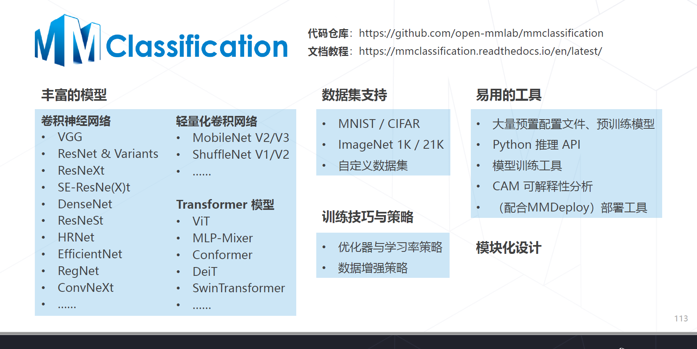

# day2 图像分类

## 什么是图像分类
给定一张图片，识别图像中的物体是什么

数学表示：
 

 

 

 

 

## 学习步骤
1. 收集数据
2. 定义模型
3. 训练
4. 预测

## 层次化特征的实现方式
1. 卷积实现一步特征提取👉 卷积神经网络
2. 多头注意力实现一步特征提取👉 Transformer

## 那些英雄神经网络
- AlexNet(2012)
- VGG(2014)
- GoogLeNet(2014)
- ResNet(2015)
- NAS series(2016+)
- ViT(2020+)
- ConvNeXt(2022)

## 模型学习的范式
- 范式一：监督学习
- 范式二：自监督学习
## 学习率与优化器策略
- 权重初始化
- 学习率策略
- 早停Early Stopping
- 模型权重平均EMA
## 数据增强
- 组合数据增强AutoAugment & RandAugment
- 组合图像Mixup & CutMix
- 标签平滑Label Smoothing
## MMClassification
代码仓库：https://github.com/open-mmlab/mmclassification

