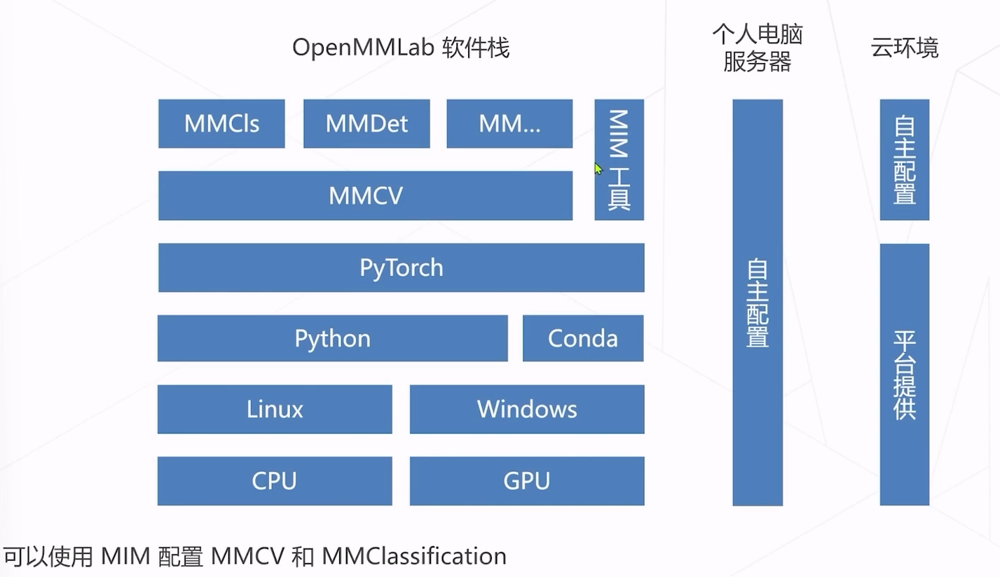

# Day3 图像分类代码实战与超算平台介绍

## 训练概述
openmmLab 是基于Pytorch的集成训练测试部署一体


- 深度学习模型的训练涉及几个方面：
  - 模型结构：模型有几层，每层有多少通道等等
  - 数据集：用什么数据训练模型：数据集划分、数据文件路径、数据增强策略等等
  - 训练策略：梯度下降算法、学习率参数、batch_size、训练总轮次、学习率变化策略等等
  - 运行时：GPU、分布式环境配置等等
  - 一些辅助功能：Logging, checkpoints and so on.
- 在OpenMMLab 项目中，所有这些项目都涵盖在一个配置文件中，一个配置文件定义了一个完整的训练V过程
  - model字段定义模型
  - data字段定义数据
  - optimizer、lr_config 等字段定义训练策略
  - load_from 字段定义与训练模型的参数文件

## 具体训练
https://github.com/wangruohui/sjtu-openmmlab-tutorial
https://gitee.com/open-mmlab/mmclassification

```py
pip install -U pip
pip install -U torch==1.10.2 torchvision==0.11.3
pip install openmim
echo "openmim here========================================================="
mim install mmcv-full
mim install mmcls

mim download mmcls --config mobilenet-v2_8xb32_in1k --dest .

curl -O https://zihao-openmmlab.obs.myhuaweicloud.com/20220716-mmclassification/dataset/fruit30/fruit30_split.zip
unzip -q fruit30_split.zip


cp mobilenet-v2_8xb32_in1k mobilenet-v2_fruit.py
# 这里去修改 mobilenet-v2_fruit.py


mim train mmcls mobilenet-v2_fruit.py
```
