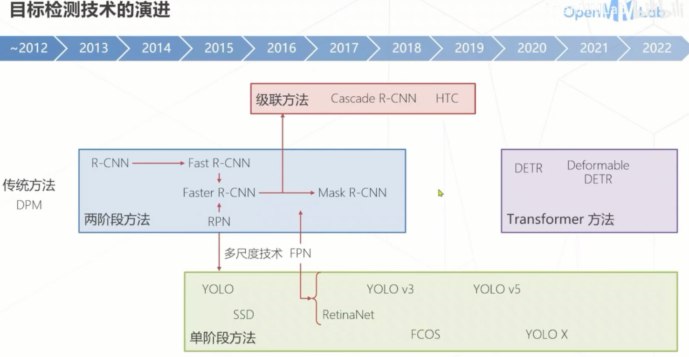
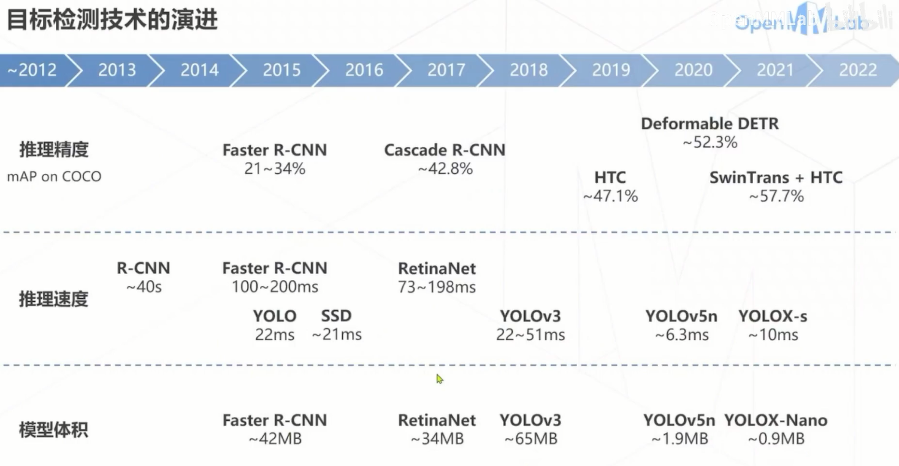

# Day 4 目标检测

用矩形框框出所有感兴趣物体 同时预测物体类别。

## 基本概念
- 框，边界框（Bounding Box）
  描述一个框需要4个像素值：
  - 方式1：左上右下边界坐标𝑙, 𝑡, 𝑟, 𝑏
  - 方式2：中心坐标和框的长宽𝑥, 𝑦, 𝑤, ℎ
- 区域（Region）：框的同义词
- 区域提议（Region Proposal，Proposal）
  指算法预测的可能包含物体的框，某种识别能力不强的算法的初步预测结果
- 感兴趣区域（Region of Interest，RoI）
- 锚框（Anchor Box，Anchor）
  图中预设的一系列基准框，类似滑窗，一些检测算法会基于锚框预测边界框
- 交并比（IoU）
  定义为两矩形框交集面积与并集面积之比，是矩形框重合程度的衡量指标
- 置信度（Confidence Score）
  模型认可自身预测结果的程度，通常需要为每个框预测一个置信度
- 正确结果(True Positive)：算法检测到了某类物体(Positive)，图中也确实有这个物体，检测结果正确(True)
- 假阳性(False Positive)：算法检测到了某类物体(Positive)，但图中其实没有这个物体，检测结果错误(False)
- 假阴性(False Negative)：算法没有检测到物体(Negative)，但图中其实有某类物体，检测结果错误(False)
- 召回率recall 
  正确结果总数 / 真值框总数 = #TP / (#TP + #FN)
- 准确率precision 
  正确结果总数 / 检测框总数 = #TP / (#TP + #FP)
- Harmonic Mean
  2 * Recall * Precision /(Recall + Precision)

## 技术演进
1. 滑窗技术与改进
2. 两阶段方法
   产生窗， 窗口内特征预测
   Faster R-CNN, Mask R-CNN
3. 单阶段方法
   单点特征实现密集预测
   RetinaNet,YOLO
4. Transformer
   DETR, Deformable DETR

