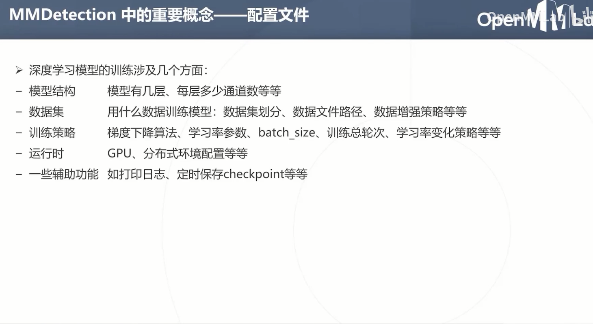

# Day 5

## MMDetection
MMDetection 提供400余个性能优良的预训练模型，开箱即用，几行Python API即可调用强大的检测能力, 涵盖60 余个目标检测算法，并提供方便易用的工具，经过简单的配置文件改写和调参就可以训练自己的目标检测模型。


MMDetection 中的常用训练策略包括SGD, learning_rate warmup 等

## COCO 数据集的标注格式


- 所有标注信息存储在一个列表中，每个标注对应
图像上一个物体标注，包含以下字段
```json
annotation {
"id" : int,
"image_id" : int,
"category_id" : int,
"segmentation" : RLE or [polygon],
"area" : float,
"bbox" : [x,y,width,height],
"iscrowd" : 0 or 1,
}
```

## 环境安装



```sh
pip install openmim
pip install mmcv-full
mim install mmdet
# 下载模型
mim download mmdet --config mask_rcnn_r50_fpn_2x_coco --dest .
mim download mmdet --config yolov3_mobilenetv2_mstrain-416_300e_coco --dest .
```


## 用继承的方式修改文件。


```py
_base_ = ['yolov3_mobilenetv2_mstrain-416_300e_coco.py']
data = dict(
    samples_per_gpu=8,
    train = dict(
        img_prefix='input/newdata',
        classes=('lemon','mango', 'banana')
    )
)
model = dict(
    bbox_head=dict(
        num_classes=3
    )
)
model = dict(bbox_head=dict(num_classes=1))
load_from ='yolov3_mobilenetv2_mstrain-416_300e_coco_20210718_010823-f68a07b3.pth'
runner=dict(type='EpochBaseRunner',max_epochs=10)
optimizer = dict(type='SGD', lr=0.001)
lr_config = None
log_config = dict(interval=25, hooks=[ dict(type="TextLoggerHook") ])
```

## 开始训练


```sh
mim train mmdet fruit.py
```

## 推理
单个文件
```py
from mmdet.apis import init_detector, inference_detector, show_result_pyplot

config_file = "fruit.py"
checkpoint_file = "latest.pth"
img = "lemon.jpg"
model = init_detector(config_file, checkpoint_file)
result = inference_detector(model, img)
show_result_pyplot(model, img, result)
```
推理整个文件夹
```sh
mim test  fruit.py --checkpoint latest.pth --show-dir work_dirs/fruit/
```
