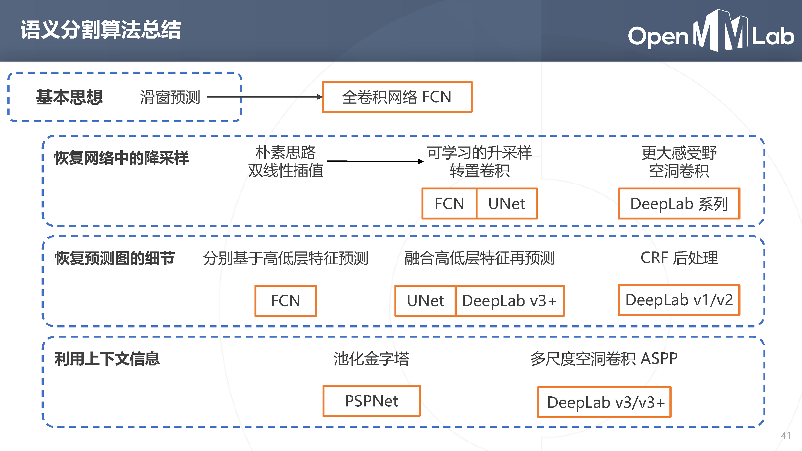

# Day 6 语义分割

## 语义分割定义
任务： 将图像按照物体的类别分割成不同的区域
等价于： 对每个像素进行分类
按照研究的粒度又可以分为：
- 语义分割：仅考虑像素的类别 不分割同一类的不同实体
- 实例分割：分割不同的实体 仅考虑前景物体
- 全景分割：背景仅考虑类别 前景需要区分实体

应用：无人驾驶汽车，人像分割，智能遥感，医疗影像分析

## 语义分割的演进
### FCN(2015)
实现了任意尺寸输入，使用降采样层（步长卷积或池化）获得高层次特征， 对预测的分割图升采样，恢复原图分辨率，升采样方案：
- 双线性插值
- 转置卷积：可学习的升采样层
### UNet(2015)
逐级融合高低层次特征
### PSPNet(2016)
- 对特征图进行不同尺度的池化，得到不同尺度的上下文特征
- 上下文特征经过通道压缩和空间上采样之后拼接回原特征图→ 同时包含局部和上下文特征
- 基于融合的特征产生预测图
### DeepLab(2014-2018)
- 使用空洞卷积解决网络中的下采样问题
- 使用条件随机场CRF 作为后处理手段，精细化分割图
- 使用多尺度的空洞卷积（ASPP 模块）捕捉上下文信息

## 分割模型的评估方法
- Accuracy
- IoU
- Dice

