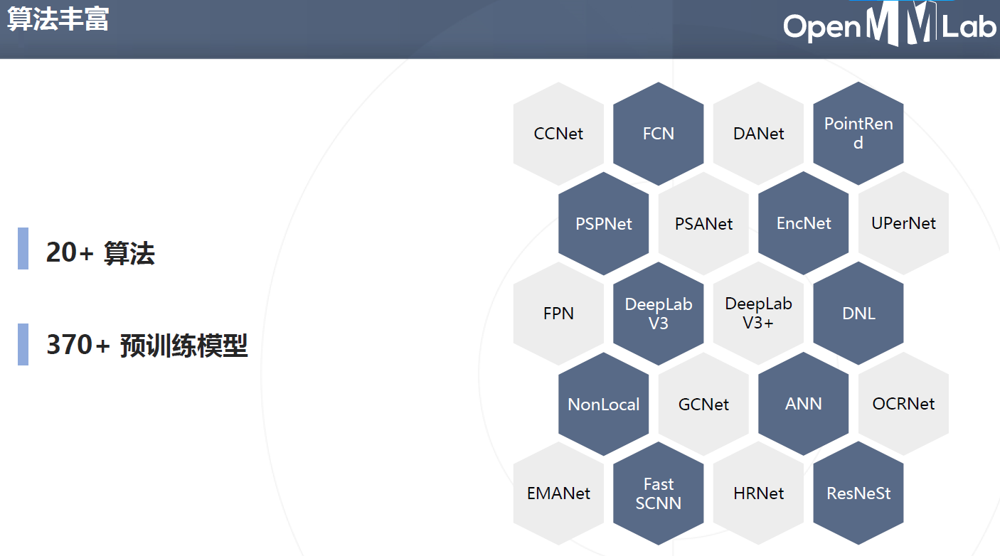
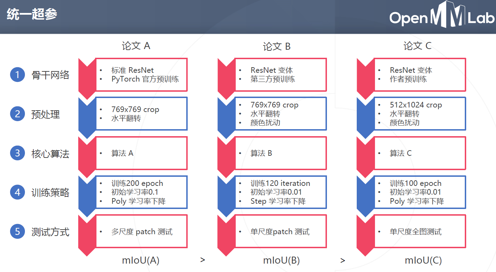
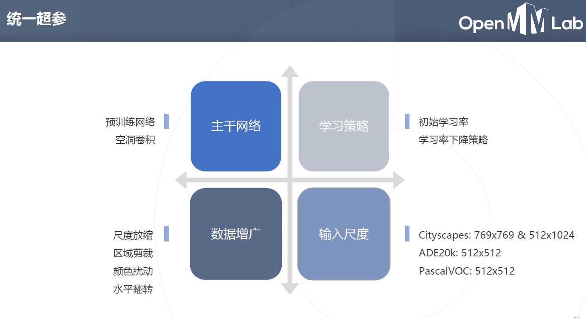
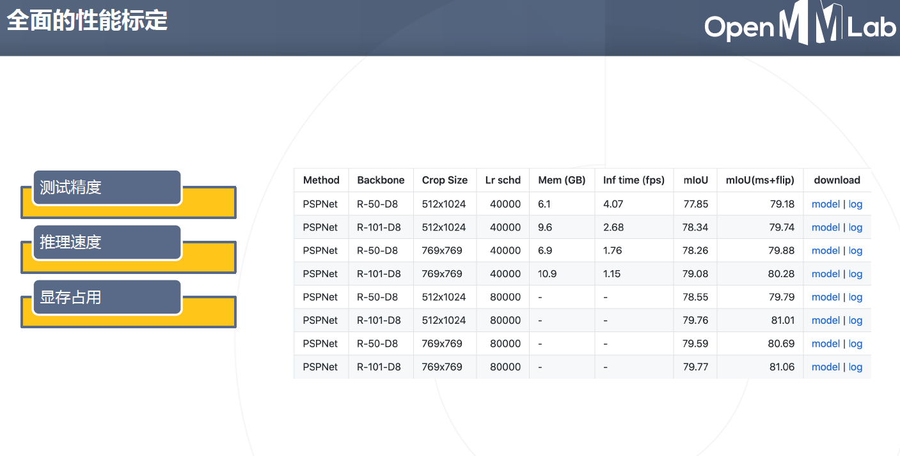
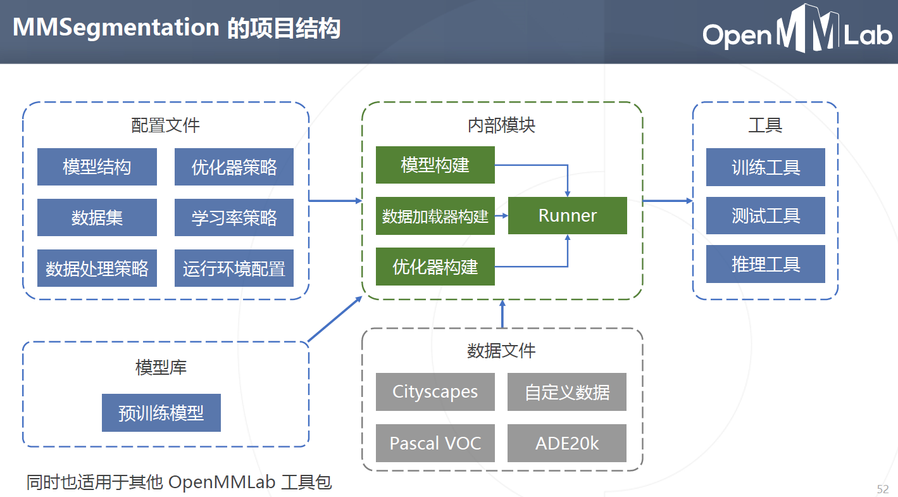
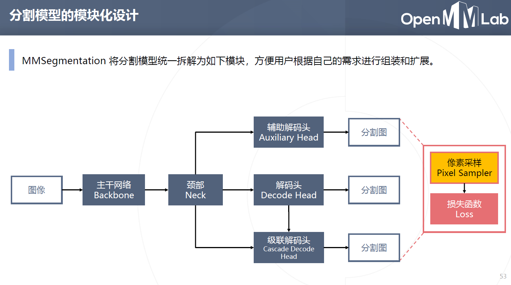

# Day 7 MMSegmentation

## MMSegmentation简介

MMsegmentation已经内置了大家耳熟能详的20+算法，370+预训练模型。 同时对模型进行合理的抽象，保证能够以很小的代价复用与替换。 
内置了全面的性能标定，这个对模型的选型非常有益。

MMSegmentation 将分割模型统一拆解为如下模块，方便用户根据自己的需求进行组装和扩展。

## 代码实战
https://github.com/open-mmlab/mmsegmentation

HRNET(High Resolution Net)始终保持高分辨率与长宽比。

CityScapes,ADE20K数据集

https://github.com/TommyZihao/MMSegmentation_Tutorials

- 单类别语义分割数据集

- 多类别语义分割数据集

- 环境安装与训练步骤

- 数据集的标注与分割

